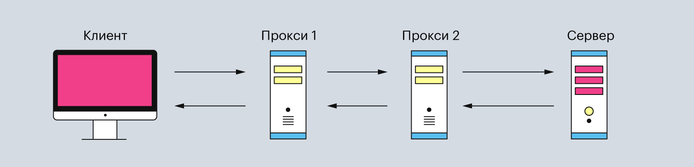

## HTTP-сообщения

**Что такое HTTP**

**HTTP (от англ. HyperText Transfer Protocol)** — протокол передачи гипертекста. Это набор правил, по которым между разными источниками передаются данные в интернете, обычно между компьютерами и серверами. Интернет-протокол HTTP — это шаблон, по которому формируется запрос на передачу данных, а затем передаются интернет-страницы, видео, аудио и текст. 

HTTP состоит из двух элементов: клиента и сервера. Клиент отправляет запросы и ждёт данные от сервера. А сервер ждёт, пока ему придёт очередной запрос, обрабатывает его и возвращает ответ клиенту.

- **Клиентом** может быть любое устройство, через которое пользователь запрашивает данные. Часто в роли клиента выступает веб-браузер, программы для отладки приложений или даже командная строка. Главная особенность клиента — он всегда инициирует запрос.

Обычно эта связь между клиентом и сервером имеет посредников в виде прокси-серверов. Они нужны для разных операций — например, для безопасности и конфиденциальности, кэширования или распределения нагрузки на серверы.

Поэтому типичная процедура отправки HTTP-запроса от клиента выглядит так:

- **Сервер** — это устройство, которое обрабатывает запросы клиента. Он может состоять как из одного компьютера, так и из кластера. А ещё несколько виртуальных серверов могут находиться на одной физической машине.

- **Прокси-серверы** — это второстепенные серверы, которые располагаются между клиентом и главным сервером. Они обрабатывают HTTP-запросы, а также ответы на них. Чаще всего прокси-серверы используют для кэширования и сжатия данных, обхода ограничений и анонимных запросов. И ещё — обычно между клиентом и основным сервером находится один или несколько таких прокси-серверов.

Данные между клиентом и сервером передаются с помощью HTTP-сообщений. Они бывают двух видов:

1. ***Запросы (HTTP Requests)*** — сообщения, которые отправляются клиентом на сервер, чтобы вызвать выполнение некоторых действий. Зачастую для получения доступа к определенному ресурсу. Основой запроса является HTTP-заголовок.
2. ***Ответы (HTTP Responses)*** — сообщения, которые сервер отправляет в ответ на клиентский запрос.
Сообщение помогает передавать информацию в текстовом виде, которая записана в несколько строчек.

### **Структура HTTP-сообщения**

Само по себе сообщение представляет собой информацию в текстовом виде, записанную в несколько строчек.

В целом, как запросы HTTP, так и ответы имеют следующую структуру:

1. **Стартовая строка (start line)** — используется для описания версии используемого протокола и другой информации — вроде запрашиваемого ресурса или кода ответа. Как можно понять из названия, ее содержимое занимает ровно одну строчку.
2. **HTTP-заголовки (HTTP Headers)** — несколько строчек текста в определенном формате, которые либо уточняют запрос, либо описывают содержимое тела сообщения.
**2.1 Пустая строка** сообщает, что все метаданные для конкретного запроса или ответа были отправлены.
3. **Опциональное тело сообщения (Message Body)**, которое содержит данные, связанные с запросом, либо документ (например HTML-страницу), передаваемый в  ответе.

Атрибуты HTTP-запроса подробнее.

**1. Стартовая строка**

Стартовая строка HTTP-запроса состоит из трех элементов:
- **Метод HTTP-запроса (method, реже используется термин verb)**.
Обычно это короткое слово на английском, которое указывает, что конкретно нужно сделать с запрашиваемым ресурсом. Например, метод GET сообщает серверу, что пользователь хочет получить некоторые данные, а POST — что некоторые данные должны быть помещены на сервер.
- **Цель запроса**.
Представлена указателем ресурса URL, который состоит из протокола, доменного имени (или IP-адреса), пути к конкретному ресурсу на сервере. Дополнительно может содержать указание порта, несколько параметров HTTP-запроса и еще ряд опциональных элементов.
- **Версия используемого протокола** (либо HTTP/1.1, либо HTTP/2) - определяет структуру следующих за стартовой строкой данных.

Пример стартовой строки

**2. Заголовки**

HTTP-заголовок представляет собой строку формата «Имя-Заголовок:Значение», с двоеточием(:) в качестве разделителя. Название заголовка не учитывает регистр, то есть между Host и host, с точки зрения HTTP, нет никакой разницы. Однако в названиях заголовков принято начинать каждое новое слово с заглавной буквы. Структура значения зависит от конкретного заголовка. Несмотря на то, что заголовок вместе со значениями может быть достаточно длинным, занимает он всего одну строчку.

В запросах может передаваться большое число различных заголовков, но все их можно разделить на три категории:

- Общего назначения, которые применяются ко всему сообщению целиком.
- Заголовки запроса уточняют некоторую информацию о запросе, сообщая дополнительный контекст или ограничивая его некоторыми логическими условиями.
- Заголовки представления, которые описывают формат данных сообщения и используемую кодировку. Добавляются к запросу только в тех случаях, когда с ним передается некоторое тело.

Самые частые заголовки запроса:

| Заголовок | Описание | 
|----------|-----------|
|**Host**|Используется для указания конкретного хоста, с которого запрашивается ресурс. В качестве возможных значений могут использоваться как доменные имена, так и IP-адреса. На одном HTTP-сервере может быть размещено несколько различных веб-сайтов. Для обращения к какому-то конкретному требуется данный заголовок.|
|**User-Agent**|Используется для описания клиента, который запрашивает ресурс. Он содержит достаточно много информации о пользовательском окружении. Например, может указать, какой браузер используется в качестве клиента, его версию, а также операционную систему, на которой этот клиент работает.|
|**Refer**|Используется для указания того, откуда поступил текущий запрос. Например, если вы решите перейти по какой-нибудь ссылке, то вероятнее всего к запросу будет добавлен заголовок Refer: https:// название сайта.ru|
|**Accept**| Используется для указания того, какой тип медиафайлов принимает клиент. В данном заголовке могут быть указаны несколько типов, перечисленные через запятую (‘ , ‘). А для указания того, что клиент принимает любые типы, используется следующая последовательность — */*.|
|**Cookie**| Этот заголовок может содержать в себе одну или несколько пар «Куки-Значение» в формате cookie=value. Куки представляют собой небольшие фрагменты данных, которые хранятся как на стороне клиента, так и на сервере, и выступают в качестве идентификатора. Куки передаются вместе с запросом для поддержания доступа клиента к ресурсу. Помимо этого, куки могут использоваться и для других целей, таких как хранение пользовательских предпочтений на сайте и отслеживание клиентской сессии. Несколько кук в одном заголовке могут быть перечислены с помощью символа точка с запятой (‘ ; ‘), который  используется как разделитель.|
|**Authorization**|Используется в качестве еще одного метода идентификации клиента на сервере. После успешной идентификации сервер возвращает токен, уникальный для каждого конкретного клиента. В отличие от куки, данный токен хранится исключительно на стороне клиента и отправляется клиентом только по запросу сервера. Существует несколько типов аутентификации, конкретный метод определяется тем веб-сервером или веб-приложением, к которому клиент обращается за ресурсом.|

**3. Тело запроса**
Завершающая часть HTTP-запроса — это его тело. Не у каждого HTTP-метода предполагается наличие тела. Так, например, методам вроде GET, HEAD, DELETE, OPTIONS обычно не требуется тело. Некоторые виды запросов  могут отправлять данные на сервер в теле запроса: самый распространенный из таких методов — POST.

## Ответы HTTP

HTTP-ответ является сообщением, которое сервер отправляет клиенту в ответ на его запрос.
Его структура равна структуре HTTP-запроса:
1. Стартовая строка
2. Заголовки ответа
3. Тело ответа.

**1. Строка статуса (Status line)**
Состоит из следующие элементы:
- Версия протокола (HTTP/2 или HTTP/1.1).
- Код состояния – указывает, насколько успешно завершилась обработка запроса.
- Пояснение — короткое текстовое описание к коду состояния. Используется исключительно для того, чтобы упростить понимание и восприятие человека при просмотре ответа.

Статус ответа содержит версию HTTP-протокола, который клиент указал в HTTP-запросе. А после неё идёт код статуса ответа — 200, что означает успешное получение данных. Затем — словесное описание статуса ответа: «ок».

Всего статусов в спецификации HTTP 1.1 — 40. Самые популярные из них:

- 200 OK — данные успешно получены;
- 201 Created — значит, что запрос успешный, а данные созданы. Его используют, чтобы подтверждать успех запросов PUT или POST;
- 300 Moved Permanently — указывает, что URL-адрес изменили навсегда;
- 400 Bad Request — означает неверно сформированный запрос. Обычно это случается в связке с запросами POST и PUT, когда данные не прошли проверку или представлены в неправильном формате;
- 401 Unauthorized — нужно выполнить аутентификацию перед тем, как запрашивать доступ к ресурсу;
- 404 Not Found — значит, что не удалось найти запрашиваемый ресурс;
- 405 Forbidden — говорит, что указанный метод HTTP не поддерживается для запрашиваемого ресурса;
- 409 Conflict — произошёл конфликт. Например, когда клиент хочет создать дважды данные с помощью запроса PUT;
- 500 Internal Server Error — означает ошибку со стороны сервера.

**2. Заголовки ответа**
Response Headers, или заголовки ответа, используются для того, чтобы уточнить ответ, и никак не влияют на содержимое тела. Они существуют в том же формате, что и остальные заголовки, а именно  «Имя-Значение» с двоеточием в качестве разделителя.
Заголовки помогают браузеру разобраться с полученными данными и представить их в правильном виде. Например, заголовок Content-Type сообщает, какой формат файла пришёл и какие у него дополнительные параметры, а Content-Length — сколько места в байтах занимает этот файл.

**3. Тело ответа**
Несмотря на то, что у большинства ответов тело присутствует, оно не является обязательным. Например, у кодов «201 Created» или «204 No Content» тело отсутствует, так как достаточную информацию для ответа на запрос они передают в заголовке.
Тело ответа содержит в себе сам файл. Например, сервер может вернуть код HTML-документа или отправить JPEG-картинку.

## HTTP методы

Метод — это действие, которое клиент ждёт от сервера. Например, отправить ему HTML-страницу сайта или скачать документ. 
Методы позволяют указать конкретное действие, которое мы хотим, чтобы сервер выполнил, получив наш запрос. Так, некоторые методы позволяют браузеру (который в большинстве случаев является источником запросов от клиента) отправлять дополнительную информацию в теле запроса — например, заполненную форму или документ.
Протокол HTTP не ограничивает количество разных методов, но программисты договорились между собой использовать только самые популярные:

| **Метод** | **Описание** |
|------|------|
|**GET**|Позволяет запросить некоторый конкретный ресурс. Дополнительные данные могут быть переданы через строку запроса (Query String) в составе URL (например ?param=value).О составляющих URL мы поговорим чуть позже.|
|**POST**|Позволяет отправить данные на сервер. Поддерживает отправку различных типов файлов, среди которых текст, PDF-документы и другие типы данных в двоичном виде. Обычно метод POST используется при отправке информации (например, заполненной формы логина) и загрузке данных на веб-сайт, таких как изображения и документы.|
|**HEAD**|Данный метод при использовании его в запросе позволит получить только заголовки, которые сервер бы вернул при получении GET-запроса к тому же ресурсу. Запрос с использованием данного метода обычно производится для того, чтобы узнать размер запрашиваемого ресурса перед его загрузкой.|
|**PUT**|Используется для создания (размещения) новых ресурсов на сервере. Если на сервере данный метод разрешен без надлежащего контроля, то это может привести к серьезным проблемам безопасности.|
|**DELETE**|Позволяет удалить существующие ресурсы на сервере. Если использование данного метода настроено некорректно, то это может привести к атаке типа «Отказ в обслуживании» (Denial of Service, DoS) из-за удаления критически важных файлов сервера.|
|**OPTIONS**|Позволяет запросить информацию о сервере, в том числе информацию о допускаемых к использованию на сервере HTTP-методов.|
|**PATCH**|Позволяет внести частичные изменения в указанный ресурс по указанному расположению.|

